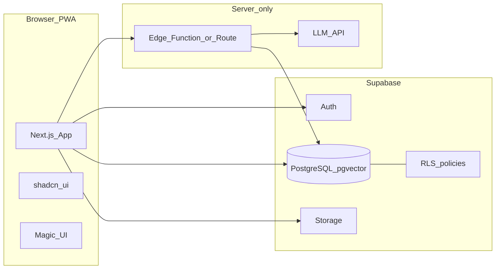
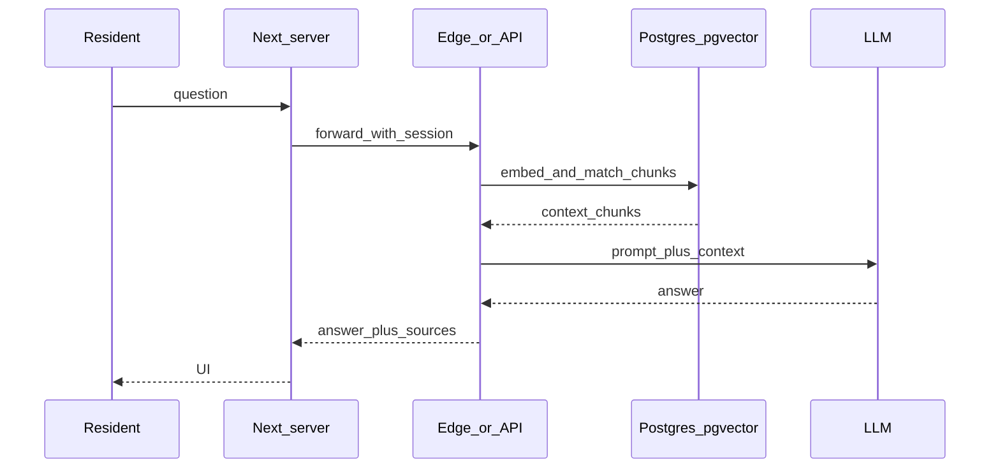

# Архитектура: консьерж ЖК

## Обзор

Браузерное PWA-приложение на Next.js обращается к Supabase (Auth, Postgres, Storage) с политиками RLS. Операции ИИ (эмбеддинги, LLM) выполняются только в Edge Functions или серверных маршрутах Next.js, без утечки секретов в клиент.

## Диаграмма компонентов



## Поток RAG



## Структура репозитория

```
/
├── apps/web/                 # Next.js
│   ├── src/app/              # App Router: (marketing), (auth), (dashboard), api/
│   ├── src/components/
│   ├── src/features/         # auth, board-moderation, admin, content, services, rag-chat
│   ├── src/lib/              # supabase clients, i18n
│   ├── messages/             # tr.json, ru.json
│   └── public/
├── supabase/
│   ├── migrations/
│   ├── functions/            # rag-chat, ingest (заготовки)
│   └── config.toml
└── docs/
```

## Схема данных (черновик)

| Сущность | Назначение |
|----------|------------|
| `profiles` | Профиль пользователя, `approval_status`, квартира, телефон |
| `user_roles` | Роль: `resident`, `board`, `admin` |
| `audit_log` | Модерация и админ-действия |
| `content_pages` | Редактируемые страницы / разделы |
| `social_zones` | Зоны и часы работы |
| `announcements` | Объявления |
| `board_members` | Публичные контакты правления |
| `service_types`, `service_requests` | Сервисы и заявки |
| `knowledge_documents`, `document_chunks` | RAG: документы и векторные чанки |
| `tester_feedback` | Сообщения от пользователей/тестировщиков об ошибках и пожеланиях к самому приложению (отделено от `suggestions`, которые адресованы правлению о ЖК) |

## RLS — принципы

- Жилец видит только свои `service_requests`.
- Контент `visibility = residents` — только при `approval_status = approved`.
- `board` / `admin` — расширенные политики на модерацию и контент.
- RPC для модерации может использовать `SECURITY DEFINER` с проверкой роли (см. миграции).
- **`user_roles`:** политика `SELECT` не должна ссылаться на ту же таблицу в подзапросе — иначе PostgreSQL даёт `42P17 infinite recursion`. Исправление: функция **`user_has_staff_role(uuid)`** (`SECURITY DEFINER`, `row_security = off`), см. миграцию `20250324180000_fix_user_roles_rls_recursion.sql`.

## Модерация и админка (веб)

- **Правление:** `board/moderation` — список `profiles` с `approval_status = pending`, действия через RPC `moderate_profile`; журнал из `audit_log` (действие `moderate_profile`).
- **Администратор:** `admin/*` — управление ролями в `user_roles` через **service role** на сервере (Next.js server actions); список email из **GoTrue Admin API** (`listUsers`).
- **Сессия и роли в SSR:** чтение своих ролей для меню и проверок делается через **service role**, ограниченное `user_id = auth.uid()` из сессии (`getStaffFlags` в `lib/profile.ts`), чтобы обойти проблемы передачи JWT в PostgREST при RSC.

## Продакшен: nginx и Next.js

- Прокси с фронта на `127.0.0.1:3000` (systemd `olive-garden-web`).
- При **502** и сообщении **`upstream sent too big header`** — увеличить буферы ответа upstream: `proxy_buffer_size`, `proxy_buffers`, `proxy_busy_buffers_size`; при необходимости `large_client_header_buffers` на уровне `server` (много/длинные `Set-Cookie` от Supabase SSR).
- Сборка на слабом VPS: `npm run build:safe` (лимит кучи Node + `webpackMemoryOptimizations` в `next.config.ts`), см. `apps/web/scripts/build-safe.sh`.

## ADR

### ADR-001: Supabase как BaaS

**Решение:** PostgreSQL + Auth + Storage + RLS в одном продукте.  
**Причина:** быстрый MVP для одного ЖК, меньше собственного API-слоя.

### ADR-002: RAG через pgvector

**Решение:** хранение эмбеддингов в Postgres, поиск `<=>` / `<->`.  
**Причина:** единая БД, проще политики доступа к чанкам.

### ADR-003: Секреты LLM только на сервере

**Решение:** ключи в `SUPABASE_SERVICE_ROLE_KEY` + секреты Edge / `process.env` на Vercel.  
**Причина:** клиент не вызывает LLM напрямую.

### ADR-004: Service role для админ-операций и части SSR

**Решение:** выдача ролей, список пользователей Auth и чтение «своих» `user_roles` в SSR выполняются только в серверном коде Next.js с `SUPABASE_SERVICE_ROLE_KEY`, с явным ограничением по `user_id` сессии где нужно.  
**Причина:** надёжность SSR с Supabase и админ-функции без отдельного бэкенда; ключ не попадает в браузер.

### ADR-005: Провайдер LLM — DeepSeek с OpenAI как fallback

**Решение:** маршрут `/api/rag/chat` использует общий слой `apps/web/src/lib/llm.ts` (`getLLMConfig()` + `chatComplete()`). Порядок выбора: `DEEPSEEK_API_KEY` → `OPENAI_API_KEY` → demo-mode. DeepSeek работает через OpenAI-совместимый endpoint `https://api.deepseek.com/v1/chat/completions`, модель по умолчанию `deepseek-v4-flash`, переопределяется через `DEEPSEEK_BASE_URL` / `DEEPSEEK_MODEL`.

**Причина:** DeepSeek даёт сравнимое качество для русско/турецко/английского RAG при ниже цене и без vendor-lock в OpenAI; единая схема запросов (OpenAI-формат) даёт минимум кода в маршруте.

**Эмбеддинги:** остаются на OpenAI (`text-embedding-3-small`, 1536-d) из-за совместимости с уже сохранёнными векторами. При отсутствии `OPENAI_API_KEY` маршрут переключается на keyword-fallback через RPC `match_document_chunks_by_text` (tsvector + ILIKE с OR-токенизацией) — рекалл хуже, но система продолжает работать на единственном DeepSeek-ключе.

### ADR-006: Обратная связь от пользователей/тестировщиков отдельно от `suggestions`

**Решение:** таблица `tester_feedback` со своими категориями (bug / feature / question / other), важностью, статусом (new / in_progress / resolved / wontfix) и автоматически собираемыми `page_url` + `user_agent`. RLS: автор видит свои и может править/удалять только пока статус `new`; правление видит и меняет всё.

**Причина:** `suggestions` — это резиденты → правление о ЖК (юридически — обращения к управляющей компании). Сообщения тестировщиков об ошибках интерфейса — это резиденты/тестировщики → разработчики, у них другие RLS-требования, отдельный workflow и аудит. Смешивать в одной таблице — лишний JOIN и риск утечки технических деталей в обычные обращения.
